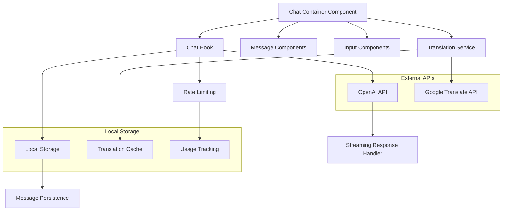

# Design Document

## Overview

The Enhanced Chat Component is a comprehensive React-based interface that provides real-time AI-powered language learning conversations. It integrates with OpenAI GPT-4 for intelligent responses, Google Translate API for multilingual support, and implements advanced features like streaming responses, context management, and persistent storage. The component serves as the core interaction layer for BhashaGPT Pro, enabling users to practice languages with an AI tutor that adapts to their learning level and provides immediate feedback.

## Architecture

### High-Level Architecture



### Component Hierarchy

```
ChatContainer (Main Component)
├── ChatHeader
│   ├── LanguageSelector
│   ├── TranslationToggle
│   └── SettingsMenu
├── MessagesContainer
│   ├── MessageList
│   │   ├── UserMessage
│   │   ├── AIMessage
│   │   └── StreamingMessage
│   ├── TypingIndicator
│   └── ErrorBoundary
└── ChatInput
    ├── TextInput
    ├── VoiceButton
    ├── SendButton
    └── StopButton
```

## Components and Interfaces

### Core Components

#### 1. ChatContainer Component

**Purpose**: Main container component that orchestrates the entire chat experience.

**Props Interface**:
```typescript
interface ChatContainerProps {
  userId?: string;
  initialLanguage?: string;
  learningLevel?: 'beginner' | 'intermediate' | 'advanced';
  autoTranslate?: boolean;
  preferredLanguage?: string;
  onLanguageChange?: (language: string) => void;
  onSessionCreate?: (session: ChatSession) => void;
}
```

**Key Features**:
- Real-time message streaming
- Language switching with session management
- Auto-translation toggle
- Error boundary implementation
- Responsive design with mobile optimization

#### 2. Enhanced useChat Hook

**Purpose**: Custom hook that manages all chat state, API interactions, and side effects.

**Interface**:
```typescript
interface UseChatReturn {
  // State
  messages: Message[];
  isLoading: boolean;
  isTyping: boolean;
  streamingMessage: string;
  error: string | null;
  retryCount: number;
  rateLimitExceeded: boolean;
  currentSession: ChatSession | null;
  
  // Actions
  sendMessage: (content: string) => Promise<void>;
  retryLastMessage: () => void;
  clearMessages: () => void;
  stopGeneration: () => void;
  createNewSession: (title?: string) => ChatSession;
  translateMessage: (text: string, targetLang: string) => Promise<string>;
  
  // Utilities
  getConversationSummary: () => ConversationSummary;
}
```

#### 3. Message Components

**UserMessage Component**:
```typescript
interface UserMessageProps {
  message: Message;
  showTranslation: boolean;
  onTranslate?: (text: string) => void;
}
```

**AIMessage Component**:
```typescript
interface AIMessageProps {
  message: Message;
  showTranslation: boolean;
  isStreaming?: boolean;
  onSpeak?: (text: string) => void;
  onTranslate?: (text: string) => void;
}
```

#### 4. Translation Service

**Purpose**: Handles all translation operations with caching and error handling.

**Interface**:
```typescript
interface TranslationService {
  translate: (text: string, targetLang: string, sourceLang?: string) => Promise<string>;
  getCachedTranslation: (key: string) => string | null;
  setCachedTranslation: (key: string, value: string) => void;
  clearCache: () => void;
}
```

### API Integration Layer

#### 1. OpenAI Streaming API Handler

**Endpoint**: `/api/chat/completion`

**Request Format**:
```typescript
interface ChatCompletionRequest {
  messages: Array<{role: 'user' | 'assistant', content: string}>;
  language: string;
  learningLevel: 'beginner' | 'intermediate' | 'advanced';
  userId: string;
  stream: boolean;
}
```

**Response Format** (Server-Sent Events):
```typescript
interface StreamingResponse {
  data: {
    content?: string;
    done?: boolean;
    error?: string;
  }
}
```

#### 2. Translation API Handler

**Endpoint**: `/api/chat/translate`

**Request Format**:
```typescript
interface TranslationRequest {
  text: string;
  targetLanguage: string;
  sourceLanguage?: string;
}
```

**Response Format**:
```typescript
interface TranslationResponse {
  translatedText: string;
  detectedLanguage?: string;
  originalText: string;
  targetLanguage: string;
}
```

## Data Models

### Message Model

```typescript
interface Message {
  id: string;
  content: string;
  translatedContent?: string;
  isUser: boolean;
  timestamp: Date;
  language: string;
  isVoice?: boolean;
  audioUrl?: string;
  metadata?: {
    tokens?: number;
    processingTime?: number;
    translationCached?: boolean;
  };
}
```

### Chat Session Model

```typescript
interface ChatSession {
  id: string;
  userId: string;
  title: string;
  language: string;
  learningLevel: 'beginner' | 'intermediate' | 'advanced';
  messages: Message[];
  createdAt: Date;
  updatedAt: Date;
  metadata: {
    messageCount: number;
    totalTokens: number;
    lastActivity: Date;
  };
}
```

### Rate Limiting Model

```typescript
interface RateLimit {
  userId: string;
  date: string;
  messagesUsed: number;
  translationsUsed: number;
  resetTime: Date;
  tier: 'free' | 'pro';
}
```

## Error Handling

### Error Types and Recovery Strategies

#### 1. Network Errors
- **Automatic Retry**: Exponential backoff (1s, 2s, 4s)
- **User Feedback**: Connection status indicator
- **Fallback**: Offline mode with cached responses

#### 2. API Rate Limits
- **Detection**: HTTP 429 status codes
- **Response**: Disable input with countdown timer
- **Recovery**: Auto-enable when limit resets

#### 3. Translation Failures
- **Graceful Degradation**: Show original text
- **Retry Logic**: Single retry with different service
- **User Control**: Manual translation request

#### 4. Streaming Interruptions
- **Detection**: Connection loss during streaming
- **Recovery**: Resume from last received token
- **User Control**: Stop/restart generation

### Error Boundary Implementation

```typescript
interface ErrorBoundaryState {
  hasError: boolean;
  error: Error | null;
  errorInfo: ErrorInfo | null;
}

class ChatErrorBoundary extends Component<Props, ErrorBoundaryState> {
  // Catches JavaScript errors anywhere in child component tree
  // Logs errors and displays fallback UI
  // Provides retry mechanism for recoverable errors
}
```

## Testing Strategy

### Unit Testing

#### 1. Hook Testing
- **useChat Hook**: Message sending, streaming, error handling
- **Translation Service**: API calls, caching, fallbacks
- **Rate Limiting**: Quota tracking, reset logic

#### 2. Component Testing
- **Message Rendering**: User/AI messages, translations
- **Input Handling**: Text input, keyboard shortcuts
- **Error States**: Network errors, rate limits

### Integration Testing

#### 1. API Integration
- **OpenAI Streaming**: Real API calls with test data
- **Translation API**: Google Translate integration
- **Error Scenarios**: Network failures, invalid responses

#### 2. Storage Integration
- **localStorage**: Message persistence, cache management
- **Session Management**: Create, restore, cleanup

### End-to-End Testing

#### 1. User Workflows
- **Complete Conversation**: Send message, receive response
- **Language Switching**: Change language, new session
- **Translation Flow**: Toggle translation, verify results

#### 2. Error Recovery
- **Network Interruption**: Simulate connection loss
- **Rate Limit Handling**: Exceed limits, verify recovery
- **API Failures**: Mock API errors, test fallbacks

### Performance Testing

#### 1. Streaming Performance
- **Latency Measurement**: Time to first token
- **Throughput Testing**: Large message handling
- **Memory Usage**: Long conversation sessions

#### 2. Storage Performance
- **Cache Efficiency**: Translation cache hit rates
- **Storage Limits**: localStorage quota management
- **Cleanup Performance**: Old message removal

## Security Considerations

### Data Protection
- **API Keys**: Server-side only, never exposed to client
- **User Data**: Minimal storage, automatic cleanup
- **Message Content**: No persistent server storage

### Rate Limiting
- **Client-Side**: Basic quota tracking for UX
- **Server-Side**: Authoritative rate limiting
- **Abuse Prevention**: IP-based and user-based limits

### Input Validation
- **Message Content**: Length limits, content filtering
- **Language Codes**: Whitelist validation
- **User IDs**: Format validation, sanitization

## Performance Optimizations

### Rendering Optimizations
- **Virtual Scrolling**: For long message histories
- **Message Memoization**: Prevent unnecessary re-renders
- **Lazy Loading**: Load older messages on demand

### Network Optimizations
- **Request Debouncing**: Prevent rapid API calls
- **Response Caching**: Cache AI responses for identical inputs
- **Connection Pooling**: Reuse HTTP connections

### Storage Optimizations
- **Compression**: Compress stored messages
- **Cleanup Strategy**: Remove old messages automatically
- **Cache Management**: LRU eviction for translations

## Accessibility Features

### Keyboard Navigation
- **Tab Order**: Logical navigation flow
- **Keyboard Shortcuts**: Send message (Ctrl+Enter)
- **Focus Management**: Proper focus handling

### Screen Reader Support
- **ARIA Labels**: Descriptive labels for all interactive elements
- **Live Regions**: Announce new messages
- **Semantic HTML**: Proper heading structure

### Visual Accessibility
- **High Contrast**: Support for high contrast mode
- **Font Scaling**: Respect user font size preferences
- **Color Independence**: Don't rely solely on color for information

## Internationalization

### Text Localization
- **UI Text**: Support for multiple UI languages
- **Error Messages**: Localized error messages
- **Date/Time**: Locale-appropriate formatting

### RTL Support
- **Layout**: Support for right-to-left languages
- **Text Direction**: Automatic text direction detection
- **Icon Mirroring**: Mirror directional icons

## Monitoring and Analytics

### Performance Metrics
- **Response Times**: API call latencies
- **Error Rates**: Failed requests by type
- **User Engagement**: Messages per session

### Usage Analytics
- **Language Preferences**: Most used languages
- **Feature Usage**: Translation, voice features
- **Session Duration**: Average conversation length

### Error Tracking
- **Client Errors**: JavaScript errors and stack traces
- **API Errors**: Failed API calls with context
- **User Feedback**: Error reports from users