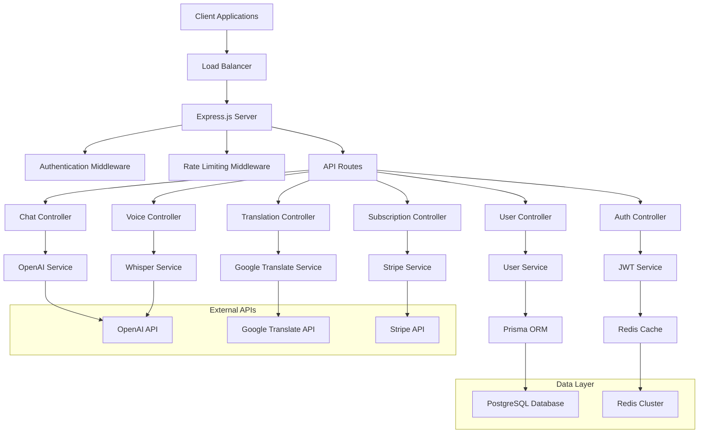

# Design Document

## Overview

The BhashaGPT Pro Express.js backend server is a comprehensive API server that provides authentication, AI integrations, user management, and subscription handling. Built with modern Node.js technologies, it offers high performance, security, and scalability for the language learning platform. The server uses Express.js as the web framework, Prisma ORM for database operations, PostgreSQL for data persistence, and Redis for caching and session management.

## Architecture

### High-Level Architecture



### Directory Structure

```
server/
├── src/
│   ├── controllers/          # Route handlers
│   ├── middleware/           # Custom middleware
│   ├── services/            # Business logic
│   ├── models/              # Database models (Prisma)
│   ├── routes/              # API route definitions
│   ├── utils/               # Utility functions
│   ├── config/              # Configuration files
│   ├── types/               # TypeScript type definitions
│   └── app.ts               # Express app setup
├── prisma/
│   ├── schema.prisma        # Database schema
│   └── migrations/          # Database migrations
├── tests/                   # Test files
├── docker/                  # Docker configuration
├── scripts/                 # Deployment scripts
└── docs/                    # API documentation
```

## Components and Interfaces

### Core Components

#### 1. Express Application Setup

**Purpose**: Main application configuration with middleware, routes, and error handling.

**Key Features**:
- CORS configuration
- Security headers
- Request parsing
- Error handling
- Health checks

```typescript
interface AppConfig {
  port: number;
  nodeEnv: 'development' | 'production' | 'test';
  corsOrigins: string[];
  rateLimiting: RateLimitConfig;
  security: SecurityConfig;
}
```

#### 2. Authentication System

**Purpose**: JWT-based authentication with refresh tokens and role-based access control.

**Components**:
- JWT Service for token generation/validation
- Auth middleware for route protection
- Refresh token rotation
- Password hashing with bcrypt

```typescript
interface AuthService {
  generateTokens(userId: string): Promise<TokenPair>;
  validateAccessToken(token: string): Promise<JWTPayload>;
  refreshTokens(refreshToken: string): Promise<TokenPair>;
  hashPassword(password: string): Promise<string>;
  comparePassword(password: string, hash: string): Promise<boolean>;
}

interface TokenPair {
  accessToken: string;
  refreshToken: string;
  expiresIn: number;
}
```

#### 3. Rate Limiting System

**Purpose**: Redis-based rate limiting with different tiers for free and paid users.

**Features**:
- Sliding window rate limiting
- Per-user and per-IP limits
- Subscription-based limits
- Graceful degradation

```typescript
interface RateLimiter {
  checkLimit(key: string, limit: number, window: number): Promise<RateLimitResult>;
  getUserLimits(userId: string): Promise<UserLimits>;
  resetUserLimits(userId: string): Promise<void>;
}

interface RateLimitResult {
  allowed: boolean;
  remaining: number;
  resetTime: Date;
  retryAfter?: number;
}
```

#### 4. OpenAI Integration Service

**Purpose**: Handles GPT-4 chat completions and Whisper speech-to-text with streaming support.

**Features**:
- Streaming chat responses
- Audio transcription
- Error handling and retries
- Usage tracking

```typescript
interface OpenAIService {
  createChatCompletion(params: ChatCompletionParams): AsyncIterable<ChatChunk>;
  transcribeAudio(audioBuffer: Buffer, options: TranscriptionOptions): Promise<TranscriptionResult>;
  handleRateLimit(error: OpenAIError): Promise<void>;
}

interface ChatCompletionParams {
  messages: ChatMessage[];
  model: string;
  temperature: number;
  maxTokens: number;
  stream: boolean;
}
```

#### 5. Translation Service

**Purpose**: Google Translate API integration with caching and fallback mechanisms.

**Features**:
- Text translation
- Language detection
- Result caching
- Batch translation support

```typescript
interface TranslationService {
  translateText(text: string, targetLang: string, sourceLang?: string): Promise<TranslationResult>;
  detectLanguage(text: string): Promise<LanguageDetection>;
  translateBatch(texts: string[], targetLang: string): Promise<TranslationResult[]>;
  getCachedTranslation(key: string): Promise<string | null>;
}
```

### Database Models (Prisma Schema)

#### User Model
```prisma
model User {
  id          String   @id @default(cuid())
  email       String   @unique
  password    String
  name        String?
  avatar      String?
  language    String   @default("en")
  timezone    String?
  createdAt   DateTime @default(now())
  updatedAt   DateTime @updatedAt
  
  // Relationships
  sessions      Session[]
  chatSessions  ChatSession[]
  subscription  Subscription?
  usageTracking UsageTracking[]
  
  @@map("users")
}
```

#### Chat Session Model
```prisma
model ChatSession {
  id          String   @id @default(cuid())
  userId      String
  title       String?
  language    String
  model       String   @default("gpt-4")
  createdAt   DateTime @default(now())
  updatedAt   DateTime @updatedAt
  
  // Relationships
  user     User      @relation(fields: [userId], references: [id], onDelete: Cascade)
  messages Message[]
  
  @@map("chat_sessions")
}
```

#### Message Model
```prisma
model Message {
  id            String   @id @default(cuid())
  sessionId     String
  role          Role
  content       String
  tokens        Int?
  audioUrl      String?
  createdAt     DateTime @default(now())
  
  // Relationships
  session ChatSession @relation(fields: [sessionId], references: [id], onDelete: Cascade)
  
  @@map("messages")
}

enum Role {
  USER
  ASSISTANT
  SYSTEM
}
```

#### Subscription Model
```prisma
model Subscription {
  id                String            @id @default(cuid())
  userId            String            @unique
  stripeCustomerId  String            @unique
  stripeSubscriptionId String?        @unique
  status            SubscriptionStatus
  plan              SubscriptionPlan
  currentPeriodStart DateTime?
  currentPeriodEnd   DateTime?
  cancelAtPeriodEnd  Boolean          @default(false)
  createdAt         DateTime          @default(now())
  updatedAt         DateTime          @updatedAt
  
  // Relationships
  user User @relation(fields: [userId], references: [id], onDelete: Cascade)
  
  @@map("subscriptions")
}

enum SubscriptionStatus {
  ACTIVE
  CANCELED
  PAST_DUE
  UNPAID
  INCOMPLETE
}

enum SubscriptionPlan {
  FREE
  PRO
  ENTERPRISE
}
```

## API Endpoints Design

### Authentication Routes
```typescript
// POST /api/auth/register
interface RegisterRequest {
  email: string;
  password: string;
  name: string;
}

// POST /api/auth/login
interface LoginRequest {
  email: string;
  password: string;
}

// POST /api/auth/refresh
interface RefreshRequest {
  refreshToken: string;
}

// POST /api/auth/logout
interface LogoutRequest {
  refreshToken: string;
}
```

### Chat Routes
```typescript
// POST /api/chat/completions
interface ChatCompletionRequest {
  messages: ChatMessage[];
  sessionId?: string;
  model?: string;
  temperature?: number;
  maxTokens?: number;
  stream?: boolean;
}

// GET /api/chat/sessions
// POST /api/chat/sessions
// GET /api/chat/sessions/:id
// DELETE /api/chat/sessions/:id
```

### Voice Routes
```typescript
// POST /api/voice/transcribe
interface TranscribeRequest {
  audio: File;
  language?: string;
  model?: 'whisper-1';
}

// POST /api/voice/synthesize
interface SynthesizeRequest {
  text: string;
  voice: string;
  language: string;
}
```

### Translation Routes
```typescript
// POST /api/translate
interface TranslateRequest {
  text: string;
  targetLanguage: string;
  sourceLanguage?: string;
}

// POST /api/translate/batch
interface BatchTranslateRequest {
  texts: string[];
  targetLanguage: string;
  sourceLanguage?: string;
}
```

## Error Handling Strategy

### Error Types and Responses

#### 1. Validation Errors
```typescript
interface ValidationError {
  type: 'VALIDATION_ERROR';
  message: string;
  field: string;
  code: string;
}
```

#### 2. Authentication Errors
```typescript
interface AuthError {
  type: 'AUTH_ERROR';
  message: string;
  code: 'INVALID_TOKEN' | 'TOKEN_EXPIRED' | 'INSUFFICIENT_PERMISSIONS';
}
```

#### 3. Rate Limit Errors
```typescript
interface RateLimitError {
  type: 'RATE_LIMIT_ERROR';
  message: string;
  retryAfter: number;
  limit: number;
  remaining: number;
}
```

#### 4. External API Errors
```typescript
interface ExternalAPIError {
  type: 'EXTERNAL_API_ERROR';
  service: 'openai' | 'google_translate' | 'stripe';
  message: string;
  retryable: boolean;
}
```

### Global Error Handler
```typescript
interface ErrorHandler {
  handleError(error: Error, req: Request, res: Response): void;
  logError(error: Error, context: ErrorContext): void;
  shouldRetry(error: Error): boolean;
}
```

## Security Implementation

### Security Middleware Stack
1. **Helmet.js**: Security headers
2. **CORS**: Cross-origin resource sharing
3. **Rate Limiting**: Request throttling
4. **Input Validation**: Request sanitization
5. **JWT Verification**: Token validation
6. **HTTPS Enforcement**: SSL/TLS only

### Data Protection
- Password hashing with bcrypt (12 rounds)
- JWT tokens with short expiration
- Refresh token rotation
- Sensitive data encryption at rest
- SQL injection prevention via Prisma
- XSS protection via input sanitization

## Performance Optimizations

### Caching Strategy
- **Redis Cache**: Session data, rate limits, translations
- **Application Cache**: User permissions, subscription data
- **Database Indexing**: Optimized queries
- **Connection Pooling**: Database connections

### Monitoring and Metrics
- **Response Time Tracking**: API endpoint performance
- **Error Rate Monitoring**: System health metrics
- **Resource Usage**: CPU, memory, database connections
- **External API Latency**: Third-party service performance

## Testing Strategy

### Unit Testing
- Service layer testing
- Utility function testing
- Middleware testing
- Database model testing

### Integration Testing
- API endpoint testing
- Database integration testing
- External API mocking
- Authentication flow testing

### End-to-End Testing
- Complete user workflows
- Subscription management flows
- Error handling scenarios
- Performance testing

## Deployment Architecture

### Docker Configuration
```dockerfile
FROM node:18-alpine
WORKDIR /app
COPY package*.json ./
RUN npm ci --only=production
COPY . .
RUN npm run build
EXPOSE 3000
CMD ["npm", "start"]
```

### Environment Configuration
```typescript
interface EnvironmentConfig {
  // Server
  PORT: number;
  NODE_ENV: string;
  
  // Database
  DATABASE_URL: string;
  REDIS_URL: string;
  
  // External APIs
  OPENAI_API_KEY: string;
  GOOGLE_TRANSLATE_API_KEY: string;
  STRIPE_SECRET_KEY: string;
  STRIPE_WEBHOOK_SECRET: string;
  
  // Security
  JWT_SECRET: string;
  JWT_REFRESH_SECRET: string;
  ENCRYPTION_KEY: string;
  
  // Features
  RATE_LIMIT_ENABLED: boolean;
  CACHE_TTL: number;
}
```

### Health Checks
```typescript
interface HealthCheck {
  status: 'healthy' | 'unhealthy';
  timestamp: string;
  services: {
    database: ServiceStatus;
    redis: ServiceStatus;
    openai: ServiceStatus;
    stripe: ServiceStatus;
  };
  metrics: {
    uptime: number;
    memoryUsage: number;
    activeConnections: number;
  };
}
```